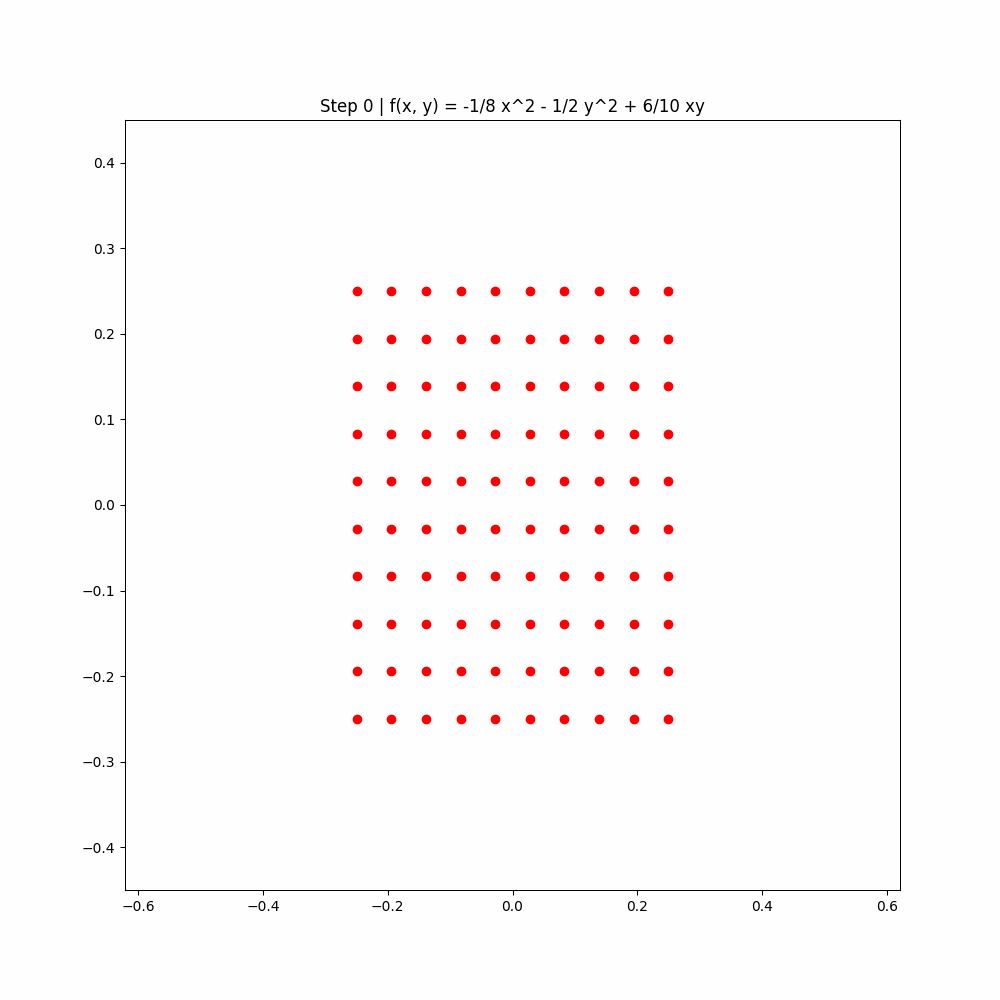

# CS3333 GAN-min-max

This repo is for CS3333 project - GAN and min-max, this repo provides experiment of GDA and OGDA on min-max optimization problem.

## Min-max

Demo of GDA and OGDA

### Case divergence on GDA but convergence on OGDA

### GDA stable but not local min-max

